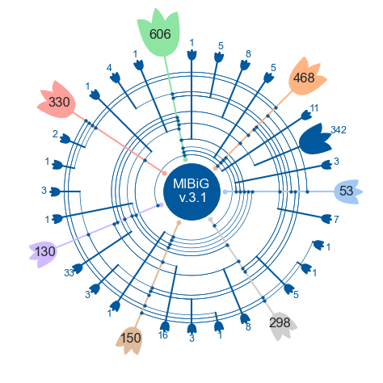

# SciArt: fancy plots for future reuse

### Installation

```bash
git clone git@github.com:latticetower/sciart.git
cd sciart
pip install .
```

## Visualization of the multiple sets: Flowerplot!



This plot is an equivalent to punchcard plot, but it draws the data in circular coordinates. 

### Example

With the random data

```python
import numpy as np
import pandas as pd

NUM_CLASSES = 5
DATASET_SIZE = 10000

data_labels = np.random.choice([True, False], size=(DATASET_SIZE, NUM_CLASSES))
class_names = [f"name_{i+1}" for i in range(NUM_CLASSES)]

labels_df = pd.DataFrame(data_labels, columns=class_names)
prepared_df = labels_df[labels_df.sum(1) > 0].value_counts().reset_index()
prepared_df['num_labels'] = prepared_df[class_names].sum(1)
prepared_df.sort_values(
    by=["num_labels"] + class_names, 
    ascending=[True] + [False] * NUM_CLASSES, 
    ignore_index=True,
    inplace=True
)
```

Resulting dataframe `prepared_df` looks like this:

|   | name_1 | name_2 | name_3 | name_4 | name_5 | count | num_labels |
| - | ------ | ------ | ------ | ------ | ------ | ----- | ---------- |
| 0 | True | False | False | False | False | 344 | 1 |
| 1 | False | True | False | False | False | 302 | 1 |
| 2 | False | False | True | False | False | 311 | 1 |
| 3 | False | False | False | True | False | 325 | 1 |
| 4 | False | False | False | False | True | 285 | 1 |
| ... |

To draw the actual plot with this data, run the following:

```python
from sciart.flowerplot import draw_flowerplot

draw_flowerplot(
    prepared_df, 
    class_columns=class_names
);
```


### Citation

If you use Flowerplot in your work, please cite:
```bibtex
@inproceedings{
    malygina2024exploring,
    title={Exploring sequence landscape of biosynthetic gene clusters with protein language models},
    author={Tatiana Malygina and Olga V. Kalinina},
    booktitle={ICML'24 Workshop ML for Life and Material Science: From Theory to Industry Applications},
    year={2024},
    url={https://openreview.net/forum?id=UguakxTKG5}
}
```
